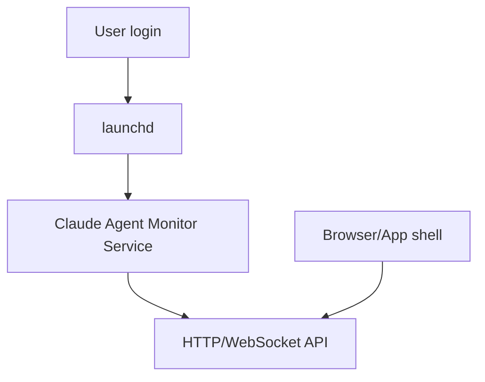

# Deployment and Background Service

## Problem

The dashboard currently requires running a Node process manually, typically through:

```bash
npm run dev
```

or an equivalent command in an open terminal.

This is inconvenient because the monitor disappears when that terminal/process stops.

## Target

The dashboard backend should run as a background service.

On macOS, the preferred mechanism is `launchd`.



## Initial approach

Add documentation and scripts for a per-user LaunchAgent.

Potential plist location:

```text
~/Library/LaunchAgents/com.claude-agent-monitor.service.plist
```

The LaunchAgent should run the production server command, not the dev server.

## Requirements

- Service starts at login.
- Service restarts on failure.
- Service logs to a predictable file.
- Dashboard can be opened in browser without opening a terminal.
- Service can be stopped/restarted from CLI.

## Example commands

```bash
launchctl bootstrap gui/$UID ~/Library/LaunchAgents/com.claude-agent-monitor.service.plist
launchctl kickstart -k gui/$UID/com.claude-agent-monitor.service
launchctl bootout gui/$UID/com.claude-agent-monitor.service
```

## Packaging path

Phase 1:

- documented launchd service;
- shell scripts for install/uninstall.

Phase 2:

- menu bar helper or small desktop wrapper;
- "Open Dashboard";
- "Start Service";
- "Stop Service".

Phase 3:

- packaged macOS app.

## Non-goals

Initial implementation should not require Electron or Tauri.

A launchd service is enough to solve the "no terminal open" problem.
