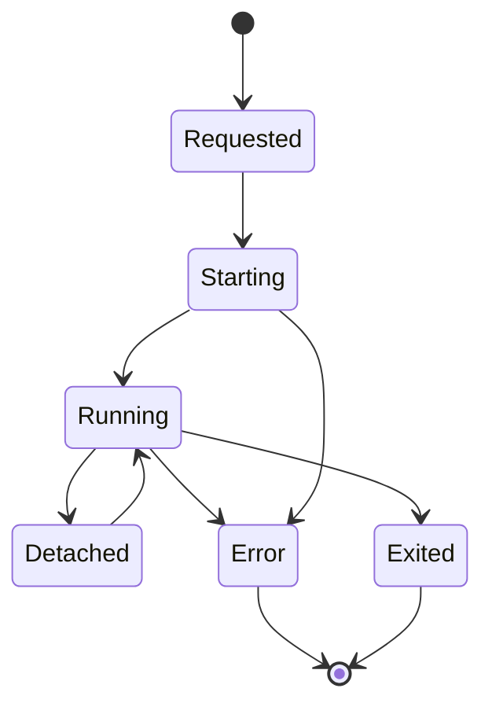

# Runtime Manager

## Responsibility

The Runtime Manager is the orchestration layer for terminal runtimes.

It owns:

- provider selection;
- runtime creation;
- runtime attachment;
- runtime lookup;
- runtime termination;
- capability discovery;
- registry updates.

## What the Runtime Manager is not

The Runtime Manager is not:

- a terminal emulator;
- a React component;
- a tmux wrapper only;
- a websocket implementation;
- a Claude hook.

It is the boundary between application intent and execution backend.

## Conceptual interface

```ts
type PersistencePolicy = "ephemeral" | "persistent";

type RuntimeProviderName = "pty" | "tmux";

interface CreateRuntimeRequest {
  sessionId?: string;
  cwd?: string;
  command?: string;
  args?: string[];
  env?: Record<string, string>;
  persistence: PersistencePolicy;
  title?: string;
}

interface RuntimeRef {
  sessionId: string;
  provider: RuntimeProviderName;
  providerId: string;
  persistence: PersistencePolicy;
  status: "starting" | "running" | "exited" | "error";
  capabilities: RuntimeCapabilities;
  metadata?: Record<string, unknown>;
}

interface RuntimeManager {
  create(request: CreateRuntimeRequest): Promise<RuntimeRef>;
  attach(sessionId: string): Promise<RuntimeAttachment>;
  resize(sessionId: string, cols: number, rows: number): Promise<void>;
  write(sessionId: string, data: string): Promise<void>;
  terminate(sessionId: string): Promise<void>;
  get(sessionId: string): Promise<RuntimeRef | null>;
  list(): Promise<RuntimeRef[]>;
}
```

## Provider selection

Initial provider selection:

```ts
if (request.persistence === "persistent") {
  return tmuxRuntime;
}

return ptyRuntime;
```

This logic must remain inside RuntimeManager, not the UI.

## Provider registry

RuntimeManager should keep a registry of available providers.

```ts
const providers = {
  pty: new PtyRuntime(...),
  tmux: new TmuxRuntime(...),
};
```

Future providers can be added without changing frontend contracts.

## Error handling

RuntimeManager should normalize provider-specific errors into application-level errors.

Examples:

- `RUNTIME_PROVIDER_UNAVAILABLE`
- `RUNTIME_NOT_FOUND`
- `RUNTIME_ATTACH_FAILED`
- `RUNTIME_CREATE_FAILED`
- `RUNTIME_ALREADY_EXISTS`
- `RUNTIME_PERMISSION_DENIED`

tmux-specific command failures should not leak raw implementation details unless debug mode is enabled.

## Lifecycle



## Migration strategy

Phase 1 should introduce RuntimeManager without changing behavior.

Existing terminal websocket should call RuntimeManager.attach instead of directly spawning tmux attach.

Once that works, session creation can be added.
