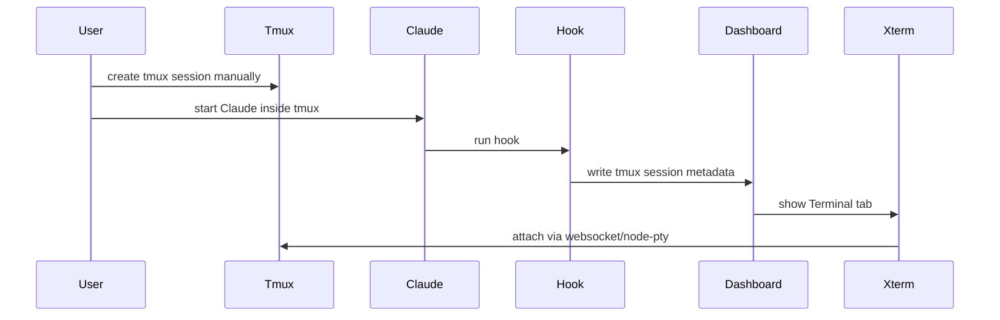
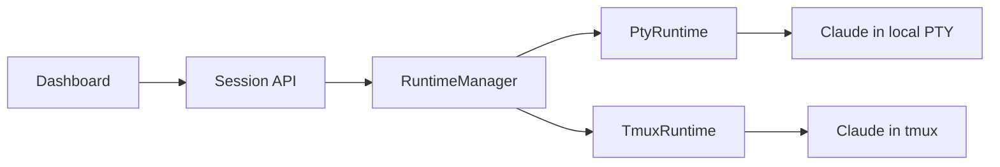
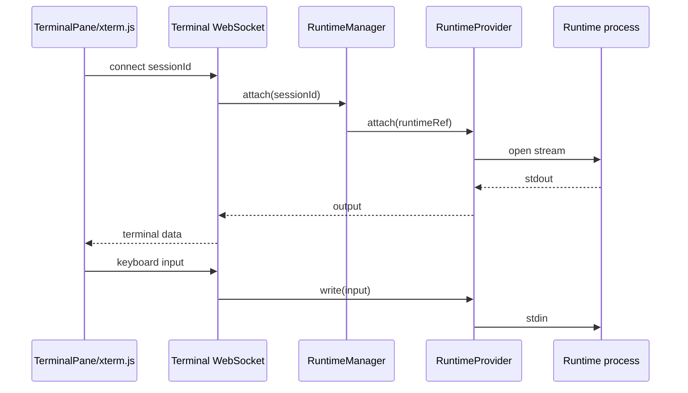

# Runtime Platform Architecture

## Purpose

This document defines the target runtime architecture for `Claude-Code-Agent-Monitor`.

The purpose is to make session creation, session attachment and terminal interaction provider-agnostic while preserving compatibility with the existing tmux-based workflow.

## Current state

The current embedded terminal implementation is based on:

- React terminal component using xterm.js;
- websocket bridge;
- node-pty;
- tmux attach;
- Claude hooks that enrich session metadata with tmux information.

The current flow is approximately:



This works, but the dashboard is an observer rather than an orchestrator.

## Target state

The target architecture introduces a Runtime Manager.



The dashboard requests a session. The Runtime Manager selects the provider.

## Fundamental rule

The frontend expresses intent.

The backend chooses implementation.

For example:

```json
{
  "persistence": "persistent",
  "cwd": "/Users/example/project",
  "command": "claude"
}
```

The frontend does not send:

```json
{
  "provider": "tmux"
}
```

Provider selection is an implementation detail.

## Persistence model

Persistence is independent from provider identity.

Initial policies:

| Policy | Meaning | Initial provider |
|---|---|---|
| `ephemeral` | Session dies when process/dashboard runtime ends | `PtyRuntime` |
| `persistent` | Session survives browser/dashboard restart | `TmuxRuntime` |

Future providers may support persistence differently.

## Initial providers

### PtyRuntime

Used for fast, local, ephemeral sessions.

Characteristics:

- starts `claude` directly using node-pty;
- no tmux required;
- simple UX;
- dies when the owning service dies;
- good for quick work.

### TmuxRuntime

Used for persistent local sessions.

Characteristics:

- creates a tmux session;
- starts `claude` inside tmux;
- survives dashboard/browser restart;
- can be reattached from terminal or dashboard;
- compatible with existing tmux workflows.

## Existing tmux sessions

Existing manual tmux sessions must remain supported.

The Runtime Manager should support two tmux cases:

1. Dashboard-created persistent sessions.
2. Externally-created tmux sessions discovered through hooks/current metadata.

The existing workflow must not be broken during migration.

## Terminal transport

xterm.js should connect to a websocket endpoint that is runtime-agnostic.

The websocket endpoint should not contain tmux-specific logic. It should ask RuntimeManager to attach to a runtime session and then pipe data between the terminal and the provider attachment stream.



## Session Registry

A Session Registry should store the mapping between application sessions and runtime state.

The registry should know:

- application session ID;
- persistence policy;
- resolved provider;
- provider-specific identifier;
- status;
- current working directory;
- command;
- timestamps;
- capabilities.

Provider-specific details should be isolated in a provider metadata object.

## Capabilities

Providers should expose capabilities.

Examples:

```json
{
  "attach": true,
  "resize": true,
  "terminate": true,
  "persistent": true,
  "externalAttach": true
}
```

The UI may use capabilities to enable or disable actions, but not to infer provider internals.

## Backwards compatibility

Migration must be incremental.

The first implementation should wrap current tmux attach logic inside `TmuxRuntime` without changing the user experience. Only after that should new session creation be introduced.

## Anti-goals

The initial implementation should not include:

- Docker runtime;
- SSH runtime;
- Kubernetes runtime;
- multi-user permissions;
- remote daemon management;
- cloud synchronization.

The architecture should allow those later, but they are not part of the first delivery.
