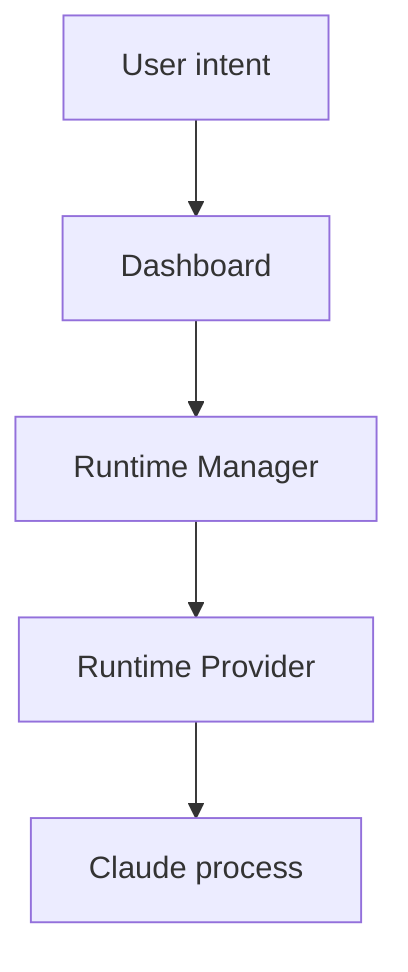

# Vision: Claude Runtime Platform

## Summary

`Claude-Code-Agent-Monitor` should evolve from a dashboard that observes existing Claude Code sessions into a runtime platform that can create, attach to, monitor and control Claude execution environments.

The current embedded terminal implementation proves that xterm.js, node-pty and tmux can be connected successfully. The next step is to generalize this into a runtime architecture that supports both ephemeral and persistent sessions.

## Long-term vision

The project should become a local-first control plane for Claude Code and related agent sessions.

It should be able to:

- discover existing Claude sessions;
- create new Claude sessions from the dashboard;
- attach to running sessions;
- distinguish ephemeral from persistent execution;
- support multiple runtime providers;
- survive browser restarts;
- eventually run as a background service;
- support future runtimes such as Docker, SSH or remote hosts without redesigning the dashboard.

## What changes conceptually

The project should stop thinking in terms of "the embedded tmux terminal".

Instead, it should think in terms of:

tmux remains important, but it becomes one provider among others.

## Product direction

The product should expose simple user-facing choices:

- Create a new session.
- Keep this session alive if the dashboard closes.
- Attach to an existing session.
- Stop a session.

The product should not require users to know whether the implementation uses tmux, node-pty or any other execution backend.

## Technical direction

The technical architecture should provide:

- a Runtime Manager;
- a Runtime Provider interface;
- an ephemeral PTY provider;
- a persistent tmux provider;
- a Session Registry;
- runtime-agnostic websocket terminal transport;
- background service support.

## Why this matters

Without this abstraction, every new capability would increase coupling:

- xterm.js would depend on tmux concepts;
- the frontend would need to know execution details;
- future Docker/SSH support would require broad rewrites;
- session creation would remain manual.

With this abstraction, the dashboard becomes stable while providers evolve independently.
